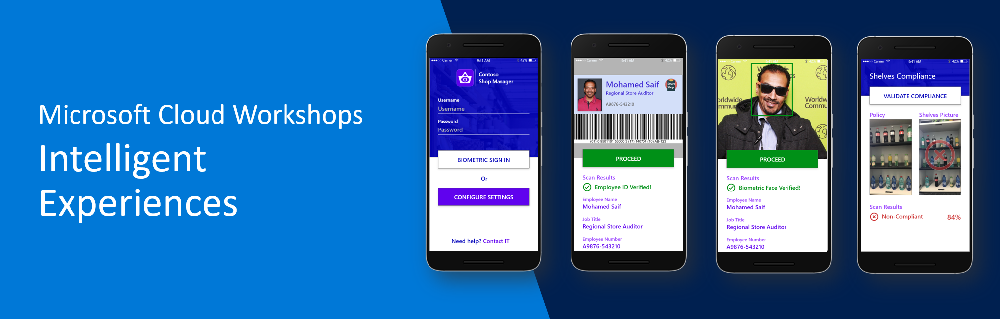

A 360 Intelligent Experiences workshop around using AI + Mobile Apps to deliver advance intelligent that help auditor and store managers to evaluate Retail market product stocking compliance

The workshop aims to educate and inform data scientists and application development teams on the importance of having Data-Driven Intelligent Apps.

The workshop will give you insights and hands-on sessions on how to leverage innovative scalable Azure AI Services and Cloud Backend Services for your applications that will help you deliver an unrivaled customer experience.

Attendees will also learn how Microsoft's Cognitive Services and Advance AI Techniques can be used in conjunction with App Development Tools to scope, design, and execute the next generation of intelligent services. 

# Workshop Requirements

## Technical Requirements

1.	Azure Subscription 
2.	Visual Studio Code (Mac or PC)
3.	Optional - Visual Studio (for PC or for Mac) with Xamarin & latest updates installed - [DOWNLOAD](https://visualstudio.microsoft.com/downloads/)
4.	Postman - [DWONLOAD](https://www.getpostman.com/)
5.  Azure Storage Explorer [DOWNLOAD](https://azure.microsoft.com/en-us/features/storage-explorer/)
6.	Python with Jupyter notebooks (required for bonus tracks) [DOWNLOAD](http://jupyter.org/)

> **NOTE:** Visit the [Setup](WalkthroughGuide/01-Setup/README.md) section of this workshop to get further details on how to setup various environment requirements.

## Target Audience

1. Data Scientists  
2. Application Developers
3. Development Leads/AI Leads

> **NOTE:** We highly recommend you setup and configure your system *before* attending one of the guided sessions. Although we’ve allowed an hour in the morning to assist in trouble shooting configurations, we won’t have time to do a fresh installation.

## Objectives

1. Demonstrate the AI platform capabilities and options
2. Show case the ease of infusing AI in the dev cycle for building AI-models,  new apps and innovating existing ones
3. Demonstrate unmatched time to value through leveraging Microsoft AI Platform
4. Deliver omnichannel intelligent apps with a consistent and outstanding end user experience

# Guided Walkthrough

You can find a walkthrough guide for the project(s) that outlines how you too can build and deploy your own version of the app, Postman and backend services.

> **NOTE:** We highly recommend you setup and configure your system before attending one of the guided sessions. Although we’ve allowed an hour in the morning to assist in trouble shooting configurations, we won’t have time to do a fresh installation.

### [1. Setup](WalkthroughGuide/01-Setup/)

### [2. Architecture Options](WalkthroughGuide/02-ArchitectureOptions/)

### [3. Cognitive Services - OCR](WalkthroughGuide/03-CognitiveServices-OCR)

### [4. Cognitive Services - Face](WalkthroughGuide/04-CognitiveServices-Face)

### [5. Cognitive Services - Custom Vision](Walkthrough%20Guide/05%20Search)

### [6. Cloud Backend & Cognitive Services](WalkthroughGuide/06-CloudDeployment)

### [7. Shop Manager App](WalkthroughGuide/07-ShopManagerApp)

### [8. Bonus Content](WalkthroughGuide\Bonus)

## Proposed Agenda

<table>
<th>Topic</th>
<th>Duration</th>
<tr>
<td>Registration and Setup</td>
<td>60 mins</td>
<tr>
<tr>
<td>Intelligent Experiences Today and Tomorrow</td>
<td>40 mins</td>
</tr>
<tr>
<td>Intelligent Retail - Shop Manager Overview</td>
<td>20 mins</td>
</tr>
<tr>
<td colspan="2">Break</td>
</tr>
<tr>
<td>Solution White-boarding</td>
<td>30 mins</td>
</tr>
<tr>
<td>Computer Vision – Options</td>
<td>30 mins</td>
</tr>
<tr>
<td>Computer Vision - Cognitive Services Setup</td>
<td>60 mins</td>
</tr>
<tr>
<td colspan="2">Lunch</td>
</tr>
<td>Computer Vision - Deployment</td>
<td>60 mins</td>
</tr>
<tr>
<td>Bring Intelligence to Mobile</td>
<td>60 mins</td>
</tr>
<tr>
<td colspan="2">Break</td>
</tr>
<tr>
<td>Conclusion and Next Steps</td>
<td>30 mins</td>
</tr>
<tr>
<td>Q and A</td>
<td>30 mins</td>
</tr>
<tr>
<td colspan="2">Bonus Workshop Material (Take home tasks)</td>
</tr>
<tr>
<td>Bonus 1 - Policy Recognition with Resnet & Transfer Learning</td>
<td>-</td>
</tr>
<tr>
<td>Bonus 2 - Policy Detection with Faster RCNN</td>
<td>-</td>
</tr>
<tr>
<td>Bonus 3 - Mobile DevOps for accelerated innovation</td>
<td>-</td>
</tr>
</table>

# Backround

## Contoso Smart Shop

### Overview
<table>
    <tr>
        <td>
            
             
            
        </td>
        <td>

* **Contoso Market** has a huge distribution network of supermarket chains across over fourteen countries. Each of these distributors is required to arrange drinks on their stands according to standardized policies. Each policy describes what shelf a given drink should be on and in what order it should be stocked.​

* There are huge costs associated with "routine" audit activities to enforce these policies. **Contoso Market** wanted to develop a system in which an auditor or store manager could take a picture and be told immediately whether the shelf was stocked correctly, like in the image below.​
        </td>
    </tr>
</table>

# Invistigation

## AI Options for Object Classifications:
**During our scoping, we investigated a couple of approaches to image classification including:**
* Custom Vision Service
* Transfer Learning using CNTK ResNet 
* Object Detection with CNTK Fast-RCNN. 
## App Development
* Highly available Mobile Backend as a Service (MBaaS) 
* Apps that targets: iOS, Android and Windows
* Apps must be native to leverage 100% of device capabilities 
* Cost efficiency is key (for both development and maintenance)
## DevOps
* Establish Continuous Integration & Continuous Delivery for app delivery

# Implemenation

## Authors

|                  |                |                |
|:----------------------------------------------:|:--------------------------------------------:|:----------------------------------------------:|
|                 **Mohamed Saif**               |            **Petra Korica**                  |                 **Sherif El Mahdi**            |
|     [GitHub](https://github.com/mohamedsaif)   | [GitHub](https://github.com/)                |  [GitHub](https://github.com/SherifElMahdi)    |
|  [Twitter](https://twitter.com/mohamedsaif101) | [Twitter](https://twitter.com/)              |        [Twitter](https://twitter.com/)         |
|         [Blog](http://blog.mohamedsaif.com)    |         [Blog](https://microsoft.com/)       |          [Blog](https://microsoft.com)         |

### Contributors

- **Ahmed Sabbour** ([GitHub](https://github.com/sabbour))
