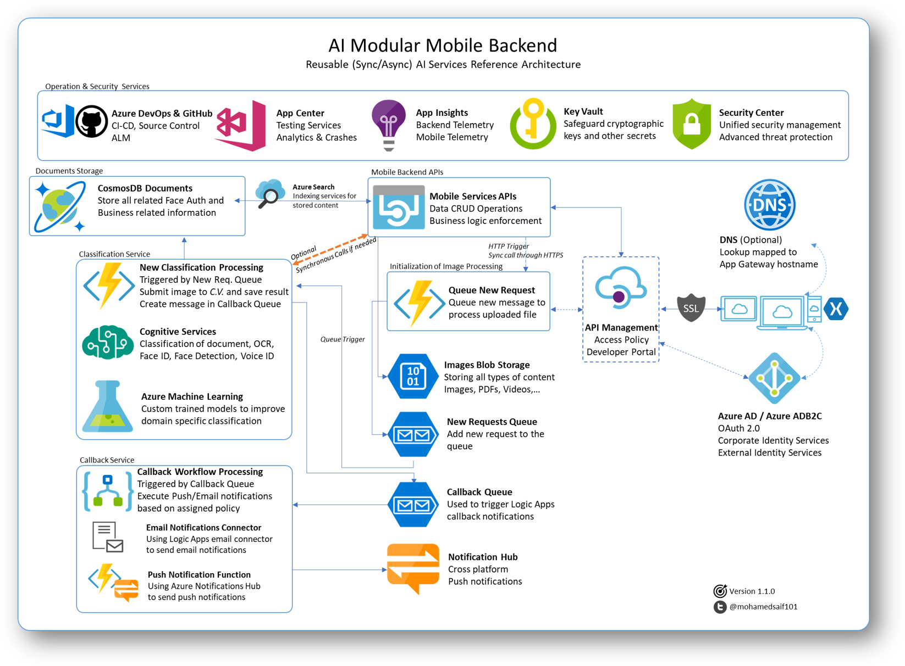
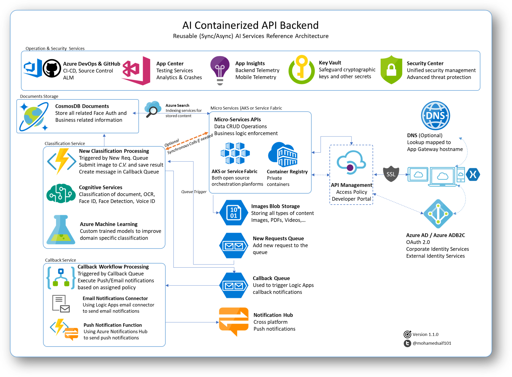
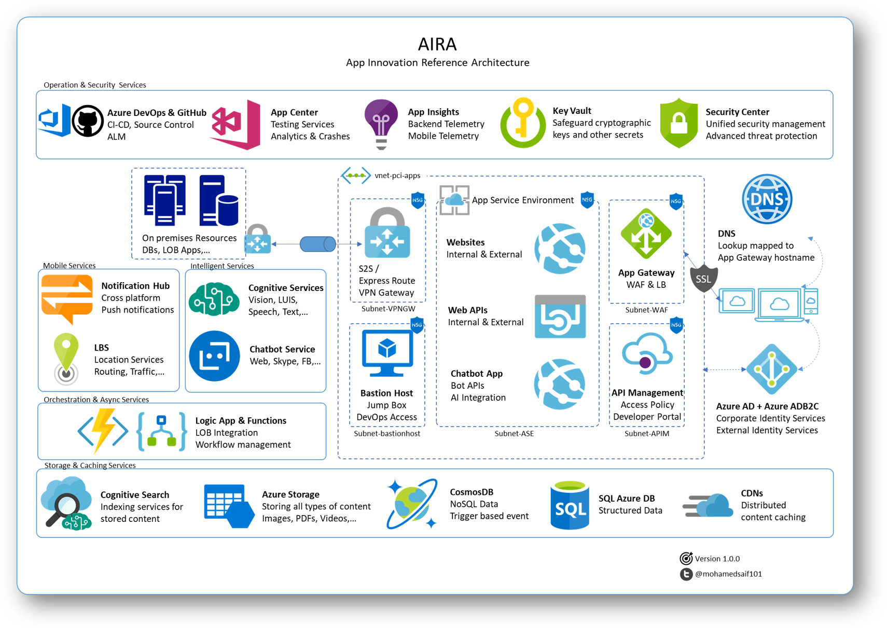

# 1. Architecture Options 
Deciding how to architect a solution isn't an easy task and depending on who you ask, you'll likely get very different answers. There are many different ways we could design such a system, and we'll cover a few of them below. 

We're looking for a solution that allows us lots of flexibility with minimal maintenance.  We're interested in focusing on the business problem rather than deploying and maintaining a set of virtual machines. 

It's for the reason that we'll opt to use Platform as a Service (PaaS) and Software as a Service (SaaS) as much as possible within our design. 
 

## The real architecture

Above you can see a high-level overview of our production architecture. Some key decisions: 

### Orchestration 
We were going to leverage our .NET skills and build a ASP.NET Web API targetting .NET Core; we've lots of flexibility on where and how to host the code. 

We picked Azure App Service as it supports great IDE integration for both Visual Studio PC and Visual Studio Mac, as well as offering all the PaaS goodness we need to focus on other parts of the solution.  

### Security
As we're not going to implement Authentication in today's workshop, we decided to add API Management to add a security layer through the use of API keys. Architecture reflect how Azure Active Directory (for corporate sign in) and Azure ADB2C (for external authentication) integrates with a production design.

### Data Storage 
We've opted for a NoSQL approach using CosmosDB. Our reasoning for this is based on a few reasons. Dealing with AI would result in un-structured list of attrictues sometime. Document base data store would make a logical sense to accomodate future growth. Also nn important part is the geo-replication features of CosmosDB make it a natural choice for new projects.

---

## Azure Functions

We can swap out the orchestration service from App Service to Azure Functions completly if we're looking to cut costs and move to a 'serverless' architecture. 

The truth is, there is a server. Azure Functions runs in the same environment as App Services, but the way we as developers interact with the service is a little different. 

The most significant difference is how we scale. With Azure Functions, we do not ever have to worry about scaling our services to meet demand. Azure Functions runs on what we call "dynamic compute", in that Microsoft will scale up, down, out and in instances of your code to meet demand. 

We will be developing a version of the backend that is entirely Azure Functions based on the future. 

---
## Micro-Services

The wave of hype and excitement about microservices continues unabated. Understanding exactly why and how your organisation will benefit from a microservice architecture is an important first step to adoption and shouldn't be left as an afterthought.

Microservices promise many benefits that are of interest to application architects and development teams, including fluid, flexible delivery of changes, implementation technology flexibility, precise scalability and cloud readiness. These promises align with growing demand from business stakeholders for new systems that can adapt to the demands of digital business in highly competitive ecosystems.  

Gartner defines a microservice as a tightly scoped, strongly encapsulated, loosely coupled, independently deployable and independently scalable application component. They first rose to popularity when digital business leaders like Netflix, Amazon, eBay and Twitter took a radically different approach to building and supporting their cloud-based applications. These applications were the antithesis of monolithic applications, where entire application scopes are developed, built, tested and deployed in concert. 

Azure offers many options for hosting your orgnaization micro-services. Service Fabric and Azure Kubernetes Service are both a great options for micro-services orchestration.

Learn more about [Service Fabric](https://azure.microsoft.com/en-us/services/service-fabric/)

Learn more about [Azure Kubernestes Service](https://docs.microsoft.com/en-us/azure/aks/)

## Connecting to remote resources securely

ExpressRoute is an Azure service that lets you create private connections between Microsoft datacenters and infrastructure that’s on your premises or in a colocation facility. ExpressRoute connections do not go over the public Internet, instead ExpressRoute uses dedicated connectivity from your resources to Azure. This provides reliability and speeds guarantees with lower latencies than typical connections over the Internet. Microsoft Azure ExpressRoute lets you extend your on-premises networks into the Microsoft cloud over a private connection facilitated by a connectivity provider. Connectivity can be from an any-to-any (IP VPN) network, a point-to-point Ethernet network, or a virtual cross-connection through a connectivity provider at a co-location facility.

Microsoft uses industry standard dynamic routing protocol (BGP) to exchange routes between your on-premises network, your instances in Azure, and Microsoft public addresses. We establish multiple BGP sessions with your network for different traffic profiles. The advantage of ExpressRoute connections over S2S VPN or accessing Microsoft cloud services over internet are as follows;

* more reliability
* faster speeds
* lower latencies
* higher security than typical connections over the Internet
* extend ExpressRoute connectivity across geopolitical boundaries (using premium add-on)

Bandwidth options available in ExpressRoute are 50 Mbps, 100 Mbps, 200 Mbps, 500 Mbps, 1 Gbps, 2 Gbps, 5 Gbps and 10 Gbps.

There are three ways to connect customer’s on-premise infrastructure to Azure (or microsoft cloud services) using ExpressRoute, they are; 
 
1. WAN integration (or call IPVPN or MPLS or any-to-any connectivity) 
2. Cloud Exchange through Co-Location Provider 
3. Point-to-Point Ethernet Connection 

A Site-to-Site VPN gateway connection is used to connect your on-premises network to an Azure virtual network over an IPsec/IKE (IKEv1 or IKEv2) VPN tunnel. This type of connection requires a VPN device located on-premises that has an externally facing public IP address assigned to it.

 
# Next Steps 
[Congnitive Services Deployment](..\03-CognitiveServices-CustomVision\README.md)
