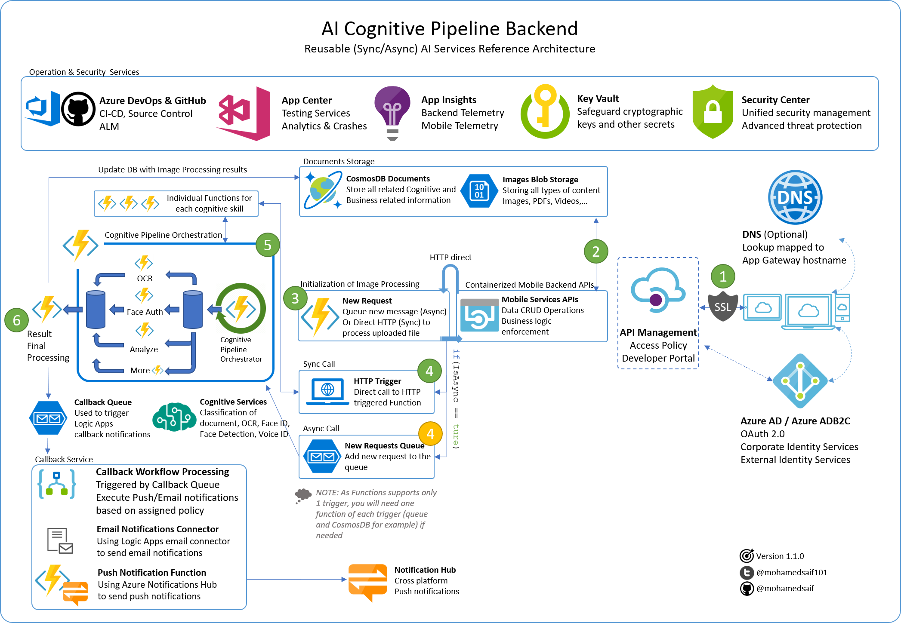

# Architecture Options

Azure architecture for Contoso Shop Manager platform is brining modular and flexible back end options. This project was designed to allow future addition of features to the AI-infused features, that is why it is built on top of a ***Serverless-based Cognitive Pipeline***

## Cognitive Piepeline

AI democratization initiative is enabling developers to take advantage of pre-trained models to bring intelligent to their applications.

[Microsoft Azure Cognitive Services]() are continously improved by adding new services or enhance the exsiting one.

That is why having a ***Cognitive Pipeline*** will allow adding new AI services to be part of the processing pipeline easily and without any significant changes to the client code.

## SDK vs APIs

It was tough choice to select Cognitive Services SDKs vs. APIs. As the matter of fact, all Cognitive Services offer APIs but not all offers solid SDKs. 

The choice to go with SDK ,when possible, made sense as it produces cleaner code and in some cases enhanced performance (like in Speech SDKs). 

> ***NOTE:*** All Cognitive Services have API-first architecture. So if you didn't find an SDK that is optimized for the platform you target, you can always fall back to using the service APIs.

## Serverless

Event driven pipeline processing was the option selected to implement the primary component of the backend.

[Azure Functions](https://azure.microsoft.com/en-us/services/functions/) offers great capabilitiy to execute complex server less scenario by combining triggers, input/output binding and [Durable Funcations](https://docs.microsoft.com/en-us/azure/azure-functions/durable-functions-overview).

I always like to think of Azure Functions like a Windows Service, it is availabe on the background listneing to potential events to respond.

## Architecture Overview

Below is how the system currently implemented by leveraging several Azure services to deliver reliable and scalable backend architecture.



Mixing multiple implementations for Azure Functions was used to optimum execution orchestration.

1. Normal Azure Functions were used to execute the specific tasks
2. Durable Azure Functions were used for orchestrating the execution of the different individual functions.

## Request Workflow

1. A client (web or mobile) will submit 4 thins to a ASP .NET API:
    1. OwnerId: currently being fixed to a static values but in the future it will be based on the authenticated user
    2. Document Type: which is basically what type of image are being submitted with the following initial values:
        1. Passport, DriverLicense, ID, BirthCertificate, Receipt, Check, Generic, Face, VoiceID, Unidentified
    3. Document Image: the actual image that will be processed by the backend
    4. IsAsync bool flag to tell the back end how this request should be processed
2. Backend APIs
    1. [Classification/SubmitDoc API]() will recieve the 4 information sent by the client and validate the request

```csharp
[HttpPost("{ownerId}/{docType}/{isAsync}")]
        public async Task<IActionResult> SubmitDoc(string ownerId, string docType, bool isAsync, IFormFile doc)
```

    2. Based on the document type, a list of instructions for the (Background Services) will be added to the request (like if it is an ID document, 2 instructions will be added to do both Face auth on the ID image and OCR to extract ID information like name, title and employee number)

```csharp
public class DocumentInstructionsProcessor
    {
        public static List<string> GetInstructions(ClassificationType docType)
        {
            List<string> instructions = new List<string>();

            switch (docType)
            {
                case ClassificationType.Passport:
                case ClassificationType.DriverLicense:
                case ClassificationType.ID:
                case ClassificationType.BirthCertificate:
                case ClassificationType.Receipt:
                    //result = InstructionFlag.AnalyzeImage | InstructionFlag.AnalyzeText;
                    instructions.Add(InstructionFlag.AnalyzeText.ToString());
                    break;
                case ClassificationType.Check:
                    instructions.Add(InstructionFlag.CustomVision.ToString());
                    instructions.Add(InstructionFlag.AnalyzeText.ToString());
                    break;
                case ClassificationType.Generic:
                    instructions.Add(InstructionFlag.AnalyzeImage.ToString());
                    break;
                case ClassificationType.Unidentified:
                    instructions.Add(InstructionFlag.AnalyzeImage.ToString());
                    break;
                default:
                    break;
            }

            return instructions;
        }
    }
```

```csharp
public enum InstructionFlag
    {
        AnalyzeImage,
        AnalyzeText,
        AnalyzeTextv2,
        Thumbnail,
        TypeVerification,
        FaceAuthentication,
        CustomVision
    }
```

    3. A new document will be created in CosmosDB ***smartdocs** collection.

```csharp
public class SmartDoc : BaseModel
    {
        public string OwnerId { get; set; }
        public string DocName { get; set; }
        public string DocUri { get; set; }
        public string TileSizeUri { get; set; }
        public string IconSizeUrl { get; set; }

        [JsonConverter(typeof(StringEnumConverter))]
        public ClassificationType DocType { get; set; }
        public string PrimaryClassification { get; set; }
        public double PrimaryClassificationConfidence { get; set; }

        //Bytes will not stored in the db. Instead will remain in the blob storage and accessed via the DocUri
        //public byte[] DocBytes { get; set; }

        public string ClassificationTagsRaw { get; set; }
        public List<SmartDocTag> ClassificationTags { get; set; }
        public string OCRTextTagsRaw { get; set; }
        public List<SmartDocTag> OCRTextTags { get; set; }
        public string ErrorMessage { get; set; }
        public string Status { get; set; }
    }
```

[View in project](/Src/Backend/BackgroundSerivces/NewReq.cs#L22)

> **NOTE:** You always want to expose your APIs behind API proxy ([Like API Management Service]()) to retain control and protect your acutal APIs endpoints.

```csharp
public class NewRequest<T> : BaseModel
    {
        public string OwnerId { get; set; }
        public string ItemReferenceId { get; set; }
        public T RequestItem { get; set; }

        //[JsonConverter(typeof(FlagConverter))]
        //[JsonConverter(typeof(StringEnumConverter))]
        //public InstructionFlag Instruction { get; set; }
        public List<string> Instructions { get; set; }
        public string Status { get; set; }
        public bool IsAsync { get; set; }
        public List<ProcessingStep> Steps { get; set; } = new List<ProcessingStep>();
    }
```

3. Backend Background Services - New Request Function:
    1. Once the request was recieved from the API, a workflow of functions will collaborate to finalize the required instructions.
4. Based on IsAsync flag, this function will do one of the of the following:
    1. Async: will create a new queue item to be picked up by Cognitive Pipeline Durable Function. The request object will be returned immedialty to the caller while the function process this document.
    2. Sync: will post an HTTP request(s) directly to the relevant function(s) and wait for the result to come back. Final cognitive processing result will be updated in CosmosDB and returned back to the caller.

5. Backend Background Services - Cognitive Pipeline Orchestrations (Durable Function) are either triggered by a queue message or http request (based on the original IsAsync flag)
    1. Fan-out/fan-in pattern was selected as these instructions can be executed in parallel.

```csharp
[FunctionName("ClassificationOrchestrator_QueueStart")]
        public static async Task QueueStart(
            //Triggers
            [QueueTrigger("newreq", Connection = "NewRequestQueue")]NewRequest<SmartDoc> newReq,

            //Durable Function Orchestration Client
            [OrchestrationClient]DurableOrchestrationClientBase starter,

            //Logger
            ILogger log)
        {
            // Function input comes from the request content.
            var newReqJson = JsonConvert.SerializeObject(newReq);
            string instanceId = await starter.StartNewAsync("ClassificationOrchestrator", newReqJson);

            log.LogInformation($"Started orchestration with ID = '{instanceId}'. Document: {newReq}");

            //return newReq;
        }
```

> **NOTE:** If your tasks must be executed in sequence, you can select ***Function Chainning Pattern*** to execute in sequnce with the ability to get the output of one function into the next. Refere back to [Durable Functions](https://docs.microsoft.com/en-us/azure/azure-functions/durable-functions-overview) documentations for futher details about orchestration patterns.
