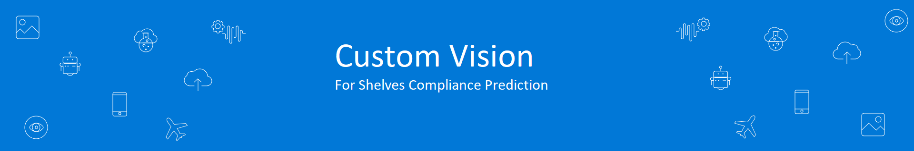

# Using Custom Vision to Assert Shelf Compliance

First thing we start is configuration a Custom Vision service to create custom prediction model for our shelves compliance assessment policy.

## Azure Computer Vision Service Creation

Great resources of Intelligence Services for developers without deeper Machine Learning knowledge are [Microsoft's Cognitive Services](https://azure.microsoft.com/en-us/services/cognitive-services/). These are a set of pre-trained Machine Learning APIs across various sections like Vision, Speech or Knowledge that developer's can simply include within their applications using a REST API.

One of these APIs is [Computer Vision](https://azure.microsoft.com/en-us/services/cognitive-services/computer-vision/), a service that tries to understand what's on a picture or video. This service can analyze pictures to generate tags and captions, detect adult or racy content, read text in images, recognizes celebrities and landmarks, detects faces and emotions and much more. You should definitely take some time to explore and play around with all these services!

Access Azure Portal [Azure Portal](https://portal.azure.com) to create a new Custom vision service.

Click on create and configure the options like the following:

Once creation is done, you can open it from the resource group you place it:

## Create Custom Vision Project

Now by visiting [Custom Vision Portal](https://customvision.ai/projects) and sign in with your Azure account you will be able to create a new project to host our new prediction model.

After connecting this new project to the created Computer Vision service, you will be ready to upload the training images

From the GitHub repo, you have a folder named **Dataset**, under it you will find **Compliant**, **Non-Compliant** and **TestImages**.

Start by uploading the images in the **Compliant** folder and set the tag to **Compliant** in the Custom Vision project.

Repeat the same for **Non-Compliant** images.

> **Hint:** If you faced issues with upload try to upload 1 by 1.

After completing the upload process, you are ready to train the model on the new tagged images. Click on **Train** to start (green button on top).

When training completes, under the tab **Performance** you will have information about the accurecy of your new model.

