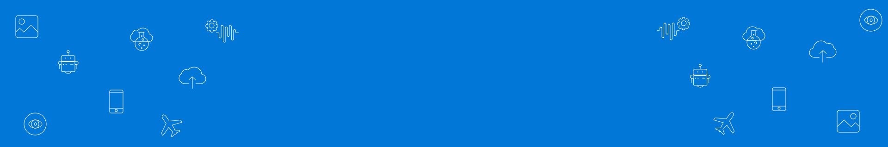
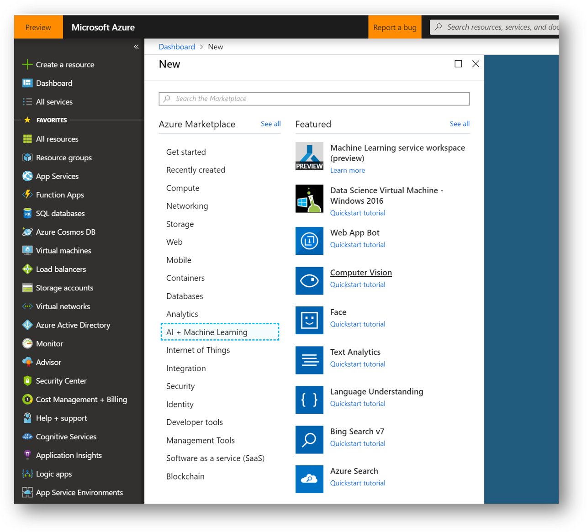
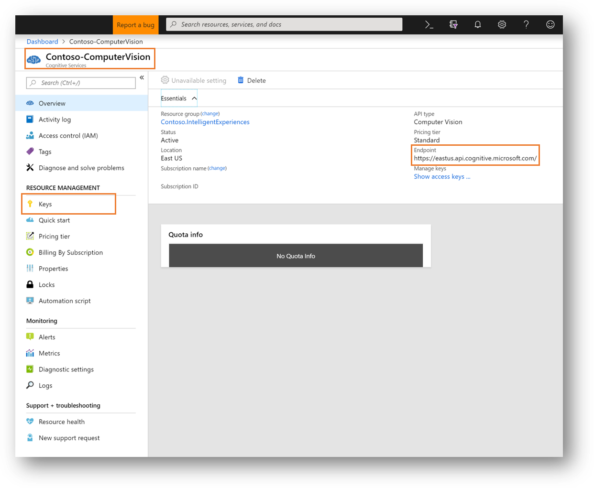
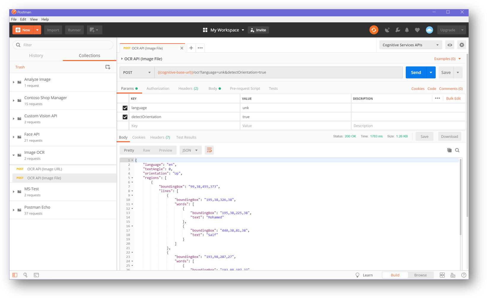

# Optical Character Recognition (OCR)

Part of the Shop Manager App sign-in experience is the Employee ID scan. In order to be able to read the information on the card (like name, job title and employee id) we need to leverage an OCR service.

Azure Cognitive Service for OCR detects text in an image using optical character recognition (OCR) and extract the recognized words into a machine-readable character stream. It saves time and effort by taking photos of text instead of inputting it to the mobile by keyboard.

Further details about [extracting text with OCR](https://docs.microsoft.com/en-us/azure/cognitive-services/computer-vision/concept-extracting-text-ocr) can be found here.

# Digital ID Authentication

In order to provide a Multi-Factor-Authentication as part of the biometric sign in in the Shop Manager App, we need to send the captured employee id image to Azure OCR service to extract texts.

>***NOTE:*** 3-factor authentication used in this workshop consist of:
>
>- Something **you know** (username & password)
>- Something **you have** (Employee ID card)
>- Something **you are** (Face biometric authentication)

You can have another look at the approach from the backend point-of-view that was discussed in the [Architecture Options](WalkthroughGuide/02-ArchitectureOptions).

# Azure Backend Setup

To leverage the OCR service, we need to provision Azure Computer Vision service to get the needed subscription keys that will be used in our backend services.



Click create and configure the service with the required information.


Once the service is provisioned, notice the following important information:

1. Endpoint (is different depending on the region you selected)
2. Keys (access to keys needed to access the service)



>***NOTE:*** The endpoint and key must be updated in the Cognitive Pipeline backend service.

## Employee ID Photo

For the demo purposes, In Contoso Shop Manager app, I allowed the user to provide the ID image either using the camera or picking up a photo from the device gallery.

> **NOTE** In production, you should only allow usage of live camera to take picture of the employee ID.

You can find a sample of [Contoso ID here](Dataset/TestImages/mosaif_id.png). Feel free to use the magic of photo shopping the image with your details :)


## Testing the service

Now that the Computer Vision service is provisioned, you can start testing it through using OCR API.

I have provided a Postman collection that you can easily import here [ImageOCR-APIs](../../Src/Postman-APIs/Image%20OCR.postman_collection.json)

Also don't forget to bring the environment variables from [CognitiveServicesAPIsCWS-Environment](../../Src/Postman-APIs/Cognitive%20Services%20APIs%20CWS.postman_environment.json) and replace the values with the onces related to your cognitive service.



## Contoso Backend

Now let's check how using this cognitive service to achieve the required business scenario for Employee ID authentication.

These are the process from the client to the backend:

### ClientSDK

All backend APIs are encapsulated in in a nice ClientSDK that offers strongly typed access to the cognitive services. Checkout the implementation here [CognitivePipeline.ClientSDK](../../Src/Backend/CognitivePipeline.ClientSDK).

All ClientSDK services have unit test associated with them. You can check this out here [](../../Src/Backend/Tests/Contoso.CognitivePipeline.ClientSDK.Tests)

```csharp
protected IDAuthClient clientInstance;

[Test]
public async Task SubmitValidCorrectId()
{
    string ownerId = Constants.OwnerId;
    string expectedValue = "Mohamed Saif";
    string testFileName = "valid_id.png";
    byte[] doc = TestFilesHelper.GetTestFile(testFileName);
    bool isAsync = false;
    bool isMinimum = true;
    var response = await clientInstance.IDAuth(ownerId, doc, isAsync, isMinimum);
    IsResultTypeValid(response);
    Assert.IsTrue(response.IsAuthenticationSuccessful, "Authentication successful");
    Assert.AreEqual(response.EmployeeName, expectedValue, $"expected result ({expectedValue}) matched");
}
```

### Cognitive Pipeline

#### Execution Tree

ClientSDK ->

- Call the services through [IDAuthClient](../../Src/Backend/CognitivePipeline.ClientSDK/Client/IDAuthClient.cs)

API Management Endpoint ->

- ClientSDK make a call to API Management endpoint passing in the base url and the access key.

CognitivePipeline.API ->

- API Management IDAuth API is connected to [IDAuthController.cs](../../Src/Backend/Contoso.CognitivePipeline.API/Controllers/IDAuthController.cs).

CognitivePipeline.BackgroundServices.NewSmartDocReq ->

- [NewSmartReq.cs](../../Src/Backend/Contoso.CognitivePipeline.BackgroundServices/NewSmartDocReq.cs) will execute synchronously to retrieve and process the results based on the requested the cognitive instructions passed [InstructionFlag.cs](../../Src/Backend/Contoso.CognitivePipeline.SharedModels/Models/InstructionFlag.cs).

```csharp
public enum InstructionFlag
{
    AnalyzeImage,
    AnalyzeText,
    Thumbnail,
    FaceAuthentication,
    ShelfCompliance
}
```

- It is worth noting that this function also execute the business logic related to producing business relevant result.
- For example, [CognitivePipelineResultProcessor](../../Src/Backend/Contoso.CognitivePipeline.BackgroundServices/Services/CognitivePipelineResultProcessor.cs) takes the raw results from the cognitive services and apply business rules and type mapping to return relevant optimized results (like returning EmployeeId after validating it against the database of users).

CognitivePipeline.BackgroundServices.NewCognitiveOCR ->

- OCR processing will happen through a dedicated function [NewCognitiveOCR](../../Src/Backend/Contoso.CognitivePipeline.BackgroundServices/NewCognitiveOCR.cs)
- This function connect to cognitive services and pass through the API results. This means it can be used with any image not only Employee Id.

# Next Steps

[Authentication - Face](../04-CognitiveServices-Face)