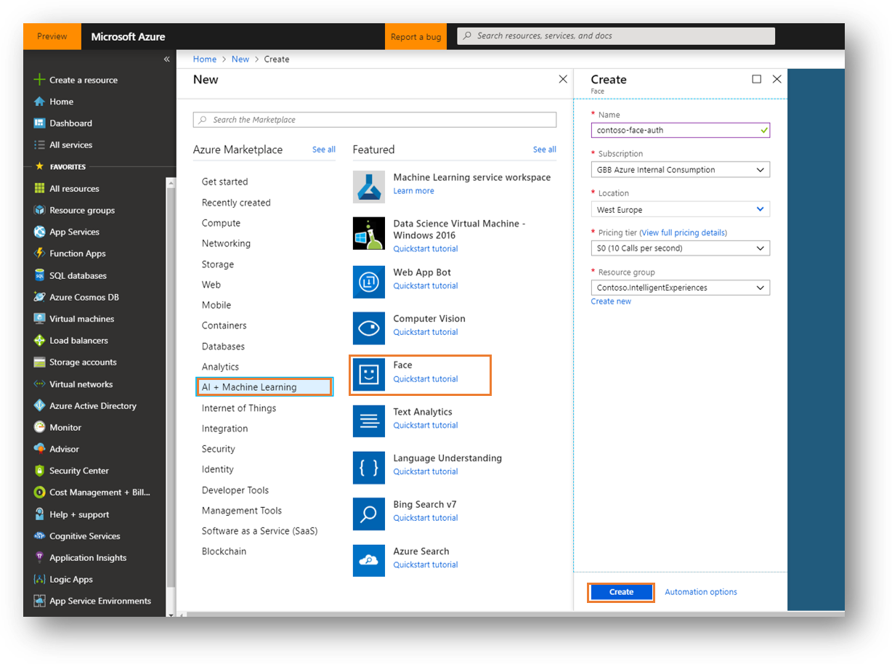
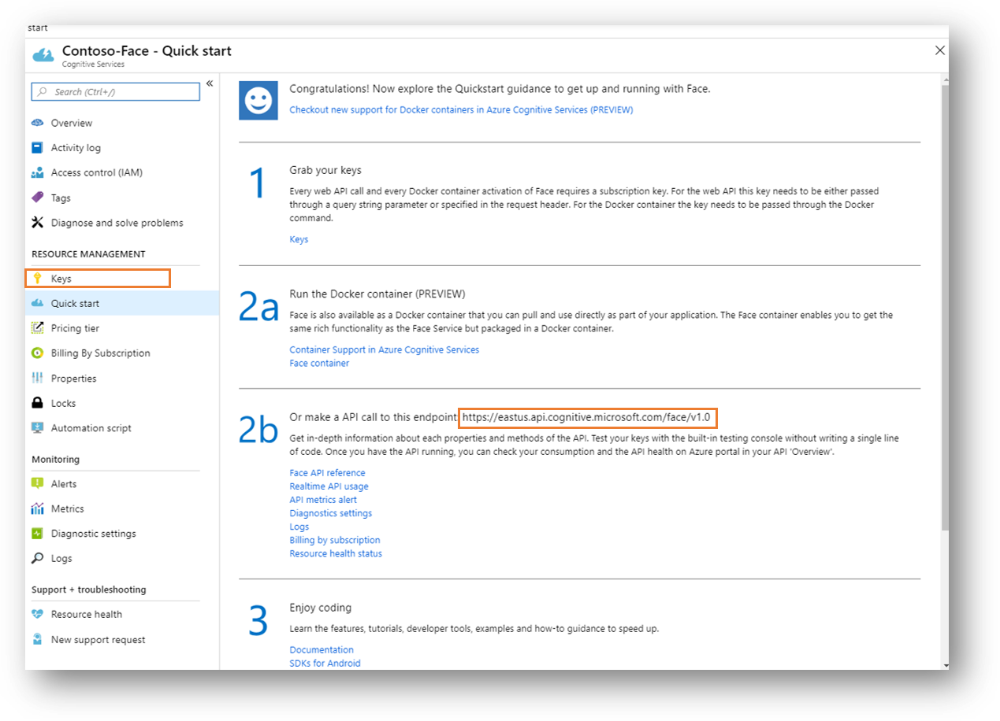
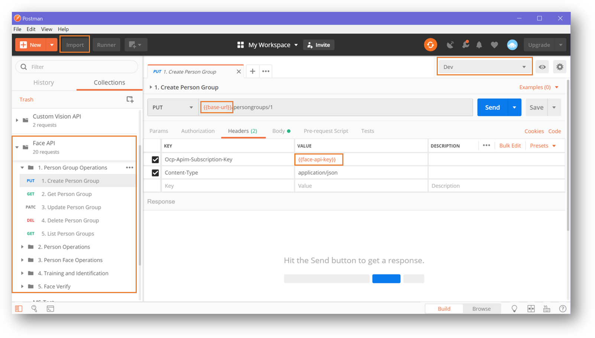
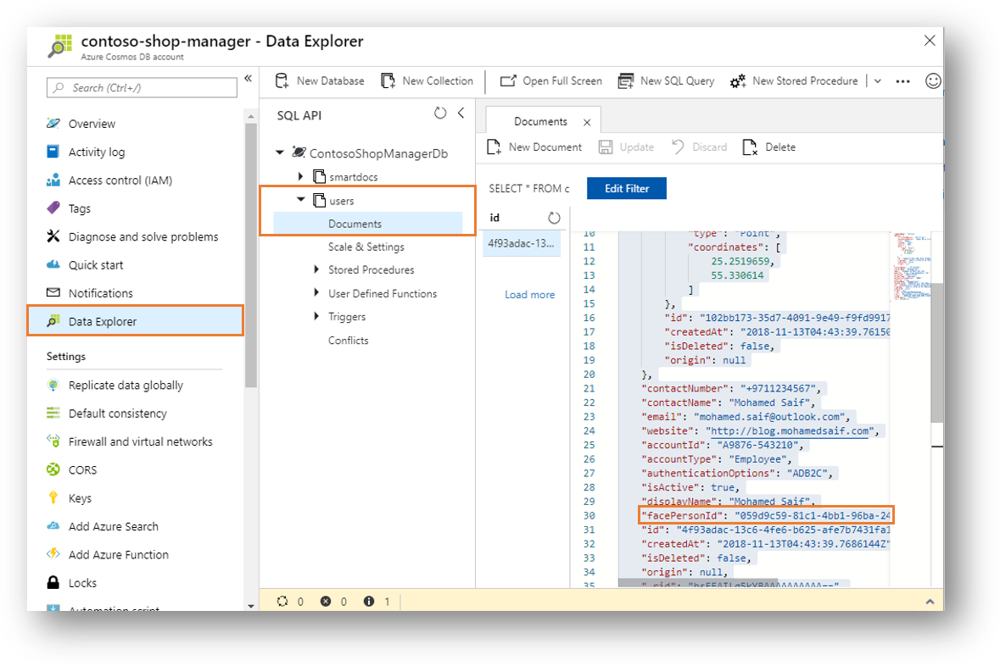
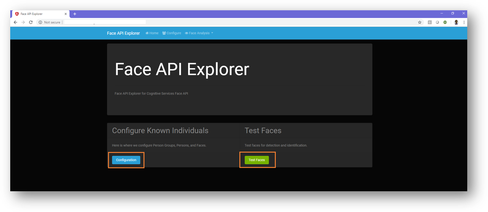
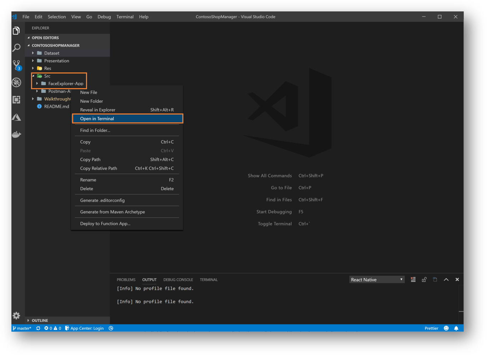
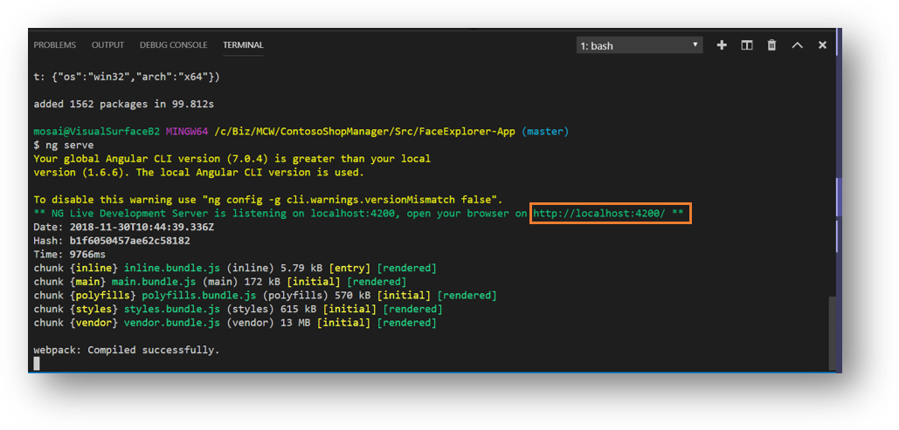

# Face Services Overview

Azure Computer Vision for Face offers comprehensive capabilities to deal with photos with faces.

You can visit [Face Portal](https://azure.microsoft.com/en-us/services/cognitive-services/face/) to test and evaluate the different capabilities.

# Employee Face Authentication

Part of Cognitive Services Face APIs is [Face Verify](https://westus.dev.cognitive.microsoft.com/docs/services/563879b61984550e40cbbe8d/operations/563879b61984550f3039523a), which verify whether two faces belong to a same person or whether one face belongs to a person.

Contoso Shop Manage app Biometric Authentication uses **Face Verify** to authenticate a live capture face image against a predefined list of employee faces.

In order to achieve this scenario, some preparation work needs to be done. Face APIs have capabilities to store faces in a secure data store.

In the below section we will provision and configure the required resources.

# Azure Backend Setup

First let's provision a dedicated Cognitive Service for Face APIs.

This can be done easily by heading out to [Azure Portal](https://portal.azure.com) and click **Create New Service** then select **Computer Vision - Face**:



After successfully provisioning the service, take a note of both the endpoint and subscription key as you will need them when accessing the Face APIs.



## Configuring Face APIs Requirements

In order to authenticate faces, you need to compare them against pre-defined faces.

Faces vector data is stored under a [Person Group](https://westus.dev.cognitive.microsoft.com/docs/services/563879b61984550e40cbbe8d/operations/563879b61984550f30395244) or [Large Person Group](https://westus.dev.cognitive.microsoft.com/docs/services/563879b61984550e40cbbe8d/operations/599acdee6ac60f11b48b5a9d).

A person group is the container of the uploaded person data, including face images and face recognition features. You can think of it as container that will hold the faces for the company or department.

After creation, use [PersonGroup Person - Create](https://westus.dev.cognitive.microsoft.com/docs/services/563879b61984550e40cbbe8d/operations/563879b61984550f3039523c) to add persons into the group, and then call [PersonGroup - Train](https://westus.dev.cognitive.microsoft.com/docs/services/563879b61984550e40cbbe8d/operations/563879b61984550f30395249) to get this group ready for [Face - Identify](https://westus.dev.cognitive.microsoft.com/docs/services/563879b61984550e40cbbe8d/operations/563879b61984550f30395239).

>***NOTE:*** The different between **Person Group** and **Large Person Group** is size. Large Person Group can hold up to 1,000,000 people while Person Group can handle 10,000 (under S0-tier subscription)

## Face APIs Configurations

In order to have a working Faces database, you need to roughly do the following:

1. Create New PersonGroup (the company private database of faces)
2. Create New Person under the PersonGroup (single person under the company)
3. Create Faces for that new Person (you can associate multiple faces with a single person to improve quality)
4. Train The Faces API on the new PersonGroup data.
5. Use both Face Detection and Face Verify to compare detected face in an image against a specific person.

### Configurations via Postman

You can accomplish all the above steps by using the different Face APIs preparation work via **Postman**.

This workshop includes a [Face-API](../../Src/Postman-APIs/Face%20API.postman_collection.json) collection that can be imported.

Collection is organized in folders that each include the relevant operations for each part of the Face APIs usage process.



Also you need to import the environment variables [Dev](../../Src/Postman-APIs/Dev.postman_environment.json). It include all variables that are being used through out the APIs (like the base url for your Face API and Key).

>**NOTE:** All APIs Postman collections used through out this workshop can be found under [Src/Postman-APIs](../../Src/Postman-APIs)

Steps to leverage Face Authentication scenario include:

1. Create a Person Group (consider this as the organization or department, default ID used is 1)
2. Create a Person (inside the created Person Group (represent an individual inside the organization)
3. Create a Person Face (with a URL to the image that hold face of the person. You can add multiple faces to a person for better recognition)
4. Train the system on the newly formed Person Group (you must do this every time you add or update Person in the Person Group)
5. Verify the training status to ensure that Face APIs are using up to date model.
6. Now you can start verifying faces using Face Detect and Verify

>***NOTE:*** Please take note of the generated PersonId as you need to update in the sample user created in CosmosDB **users** collection. You can do this via CosmosDB data explorer on Azure Portal.
>
>The sample users is created as part of the API initialization here [MockDataSeeder.cs](../../Src/Backend/Contoso.CognitivePipeline.API/Mocks/MockDataSeeder.cs)
>

## Configuration via Face Explorer App

Included with this workshop a nice Angular web application that provides GUI to interact with the Face APIs from setup to verification.

You can access the source code for [Face Explorer here](../../Src/FaceExplorer-App).



If you wish to run the Angular app locally on you machine, you need to have [Angular CLI](https://cli.angular.io/) installed. Below are the steps you should perform:

1. [NodeJs](https://nodejs.org/en/) must be installed.
2. You can then use NPM to install Angular CLI using the following command:

```js
npm install -g @angular/cli
```

>***NOTE:*** You can now open the project inside Visual Studio Code to perform the next steps. Once it is opened, you can launch a new terminal window like the screen shot below:


3. Next step will be installing all project dependencies using NPM (must be run inside the [FaceExplorer-App](../../Src/FaceExplorer-App) folder):

```js
npm install
```

4. You can then use command line or Visual Studio Code to build and run the Angular project (command must be executed in folder [FaceExplorer-App](../../Src/FaceExplorer-App)).

```js
ng serve
```



5. Copy the URL from the terminal and pasted in the browser.
6. Add your endpoint and subscription key to Face API service from Azure to the Face Explorer Service Configuration here [FaceExplorer-App/src/app/services/face-api-service.service.ts](../../Src/FaceExplorer-App/src/app/services/face-api-service.service.ts)

***Endpoint (line 11):***

```js
private baseUrl = '<specify Face API base URL here>';
```

***Subscription Key (line 130):***

```js
const httpOptions = {
  headers: new HttpHeaders({
    'Content-Type': 'application/json',
    'Ocp-Apim-Subscription-Key': '<specify Face API key here>'
  })
};
```

7. Save the changes and refresh your browser and everything should be set to go.

## Testing the service

Now that the Computer Vision for Face service is provisioned, you can start testing it through using Face APIs in Postman or Face Explorer App.

## Contoso Backend

Now let's check how using this cognitive service to achieve the required business scenario for Employee Face authentication.

These are the process from the client to the backend:

### ClientSDK

All backend APIs are encapsulated in in a nice ClientSDK that offers strongly typed access to the cognitive services. Checkout the implementation here [CognitivePipeline.ClientSDK](../../Src/Backend/CognitivePipeline.ClientSDK).

All ClientSDK services have unit test associated with them. You can check this out here [ClientSDK.Tests](../../Src/Backend/Tests/Contoso.CognitivePipeline.ClientSDK.Tests)

```csharp
protected FaceAuthClient clientInstance;

[Test]
public async Task SubmitValidCorrectFace()
{
    string ownerId = Constants.OwnerId;
    string expectedValue = "Mohamed Saif";
    string testFileName = "valid_id.png";
    byte[] doc = TestFilesHelper.GetTestFile(testFileName);
    bool isAsync = false;
    bool isMinimum = true;
    var response = await clientInstance.FaceAuth(ownerId, doc, isAsync, isMinimum);
    IsResultTypeValid(response);
    Assert.IsTrue(response.IsAuthenticationSuccessful, "Authentication successful");
    Assert.AreEqual(response.DetectedFaceName, expectedValue, $"expected result ({expectedValue}) matched");
}
```

### Cognitive Pipeline

#### Execution Tree

ClientSDK ->

- Call the services through [FaceAuthClient](../../Src/Backend/CognitivePipeline.ClientSDK/Client/FaceAuthClient.cs)

API Management Endpoint ->

- ClientSDK make a call to API Management endpoint passing in the base url and the access key.

CognitivePipeline.API ->

- API Management FaceAuth API is connected to [FaceAuthController.cs](../../Src/Backend/Contoso.CognitivePipeline.API/Controllers/IDAuthController.cs).

CognitivePipeline.BackgroundServices.NewSmartDocReq ->

- [NewSmartReq.cs](../../Src/Backend/Contoso.CognitivePipeline.BackgroundServices/NewSmartDocReq.cs) will execute synchronously to retrieve and process the results based on the requested the cognitive instructions passed [InstructionFlag.cs](../../Src/Backend/Contoso.CognitivePipeline.SharedModels/Models/InstructionFlag.cs).

```csharp
public enum InstructionFlag
{
    AnalyzeImage,
    AnalyzeText,
    Thumbnail,
    FaceAuthentication,
    ShelfCompliance
}
```

- It is worth noting that this function also execute the business logic related to producing business relevant result.
- For example, [CognitivePipelineResultProcessor](../../Src/Backend/Contoso.CognitivePipeline.BackgroundServices/Services/CognitivePipelineResultProcessor.cs) takes the raw results from the cognitive services and apply business rules and type mapping to return relevant optimized results (like returning FaceAuthCard after validating it against the database of users).

CognitivePipeline.BackgroundServices.NewCognitiveFaceAuth ->

- Face authentication processing will happen through a dedicated function [NewCognitiveFaceAuth](../../Src/Backend/Contoso.CognitivePipeline.BackgroundServices/NewCognitiveFaceAuth.cs)
- This function connect to cognitive services and pass through the API results. This means it can be used with any image not only employee faces.

# Next Steps

[Shelves Compliant AI Model](../05-CognitiveServices-CustomVision)