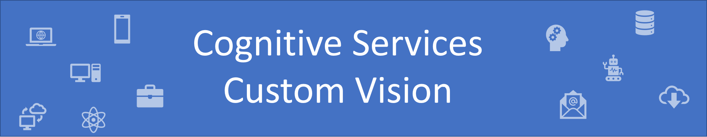
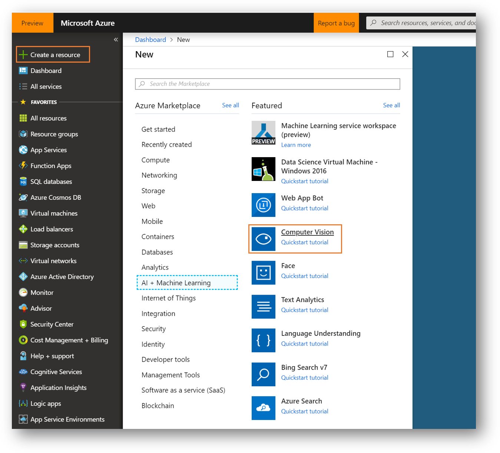
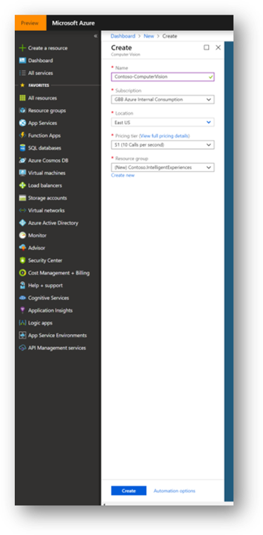
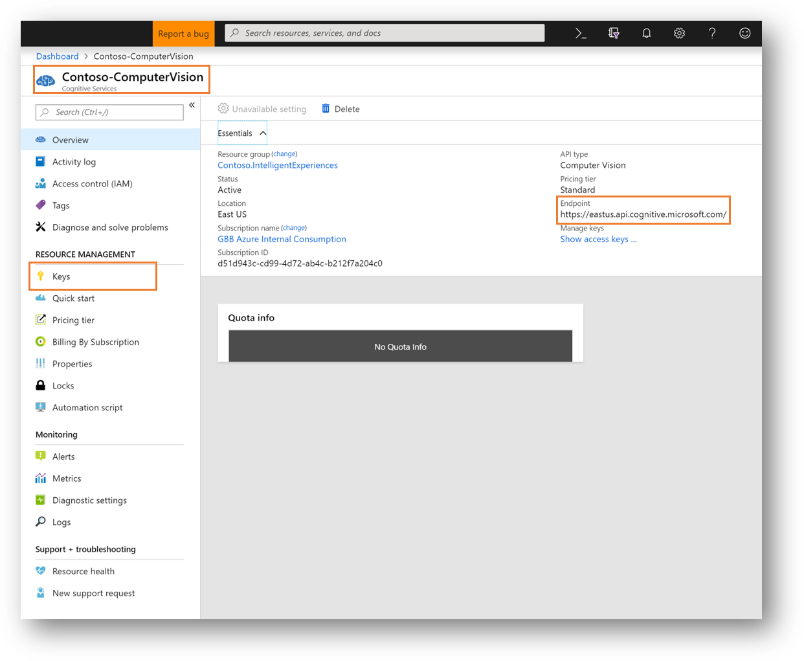
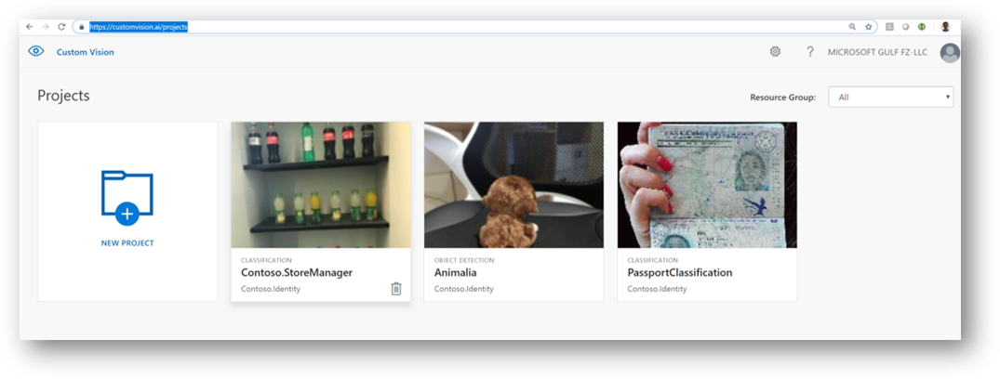
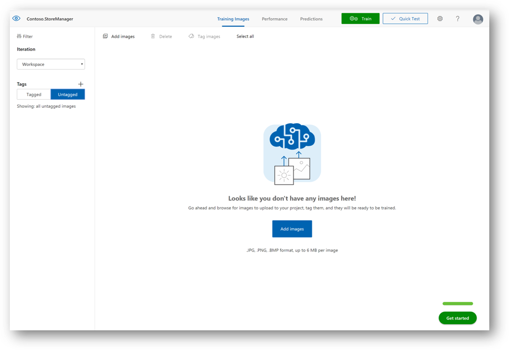

# Using Custom Vision to Assert Shelf Compliance

First thing we start is configuration a Custom Vision service to create custom prediction model for our shelves compliance assessment policy.

## Azure Computer Vision Service Creation

Great resources of Intelligence Services for developers without deeper Machine Learning knowledge are [Microsoft's Cognitive Services](https://azure.microsoft.com/en-us/services/cognitive-services/). These are a set of pre-trained Machine Learning APIs across various sections like Vision, Speech or Knowledge that developer's can simply include within their applications using a REST API.

One of these APIs is [Computer Vision](https://azure.microsoft.com/en-us/services/cognitive-services/computer-vision/), a service that tries to understand what's on a picture or video. This service can analyze pictures to generate tags and captions, detect adult or racy content, read text in images, recognizes celebrities and landmarks, detects faces and emotions and much more. You should definitely take some time to explore and play around with all these services!

## Azure Backend Setup

Access Azure Portal [Azure Portal](https://portal.azure.com) to create a new Custom vision service.



Click on create and configure the options like the following:



Once creation is done, you can open it from the resource group you place it:



## Create Custom Vision Project

Now by visiting [Custom Vision Portal](https://customvision.ai/projects) and sign in with your Azure account you will be able to create a new project to host our new prediction model.



After connecting this new project to the created Computer Vision service, you will be ready to upload the training images



From the GitHub repo, you have a folder named **Dataset**, under it you will find **Compliant**, **Non-Compliant** and **TestImages**.

Start by uploading the images in the **Compliant** folder and set the tag to **Compliant** in the Custom Vision project.


Repeat the same for **Non-Compliant** images.

> **Hint:** If you faced issues with upload try to upload 1 by 1.

After completing the upload process, you are ready to train the model on the new tagged images. Click on **Train** to start (green button on top).

When training completes, under the tab **Performance** you will have information about the accurecy of your new model.


## Testing the service

First you need to download and import the [Custom Vision APIs Collection](../../Src/Postman-APIs/Custom_Vision_API.postman_collection.json) along with the [Dev Environment](../../Src/Postman-APIs/Dev.postman_environment.json) to easily get started with your testing.

Please update the relevant parameters to reflect your endpoints and keys.

You will notice you have two options to call you custom vision endpoint, one with URL to the image and the other with the actual image file submitted as part of the request body.

This is a common approach of almost all Computer Vision APIs.

## Contoso Backend

Now let's check how using this cognitive service to achieve the required business scenario for shelves compliance.

These are the process from the client to the backend:

### ClientSDK

All backend APIs are encapsulated in in a nice ClientSDK that offers strongly typed access to the cognitive services. Checkout the implementation here [CognitivePipeline.ClientSDK](../../Src/Backend/CognitivePipeline.ClientSDK).

All ClientSDK services have unit test associated with them. You can check this out here [ClientSDK.Tests](../../Src/Backend/Tests/Contoso.CognitivePipeline.ClientSDK.Tests)

```csharp
protected ShelvesComplianceClient clientInstance;

[Test]
public async Task SubmitValidCompliantShelves()
{
    string ownerId = Constants.OwnerId;
    var testFileName = "valid1.jpg";
    byte[] doc = TestFilesHelper.GetTestFile(testFileName);
    bool isAsync = false;
    bool isMinimum = true;
    var response = await clientInstance.ValidateShelvesCompliace(ownerId, doc, isAsync, isMinimum);
    IsResultTypeValid(response);
    Assert.IsTrue(response.IsConfidenceAcceptable, "Classification threshold passed");
    Assert.IsTrue(response.IsCompliant, $"Classification of {response.DetectionNotes}");
}
```

### Cognitive Pipeline

#### Execution Tree

ClientSDK ->

- Call the services through [ShelvesComplianceClient](../../Src/Backend/CognitivePipeline.ClientSDK/Client/ShelvesComplianceClient.cs)

API Management Endpoint ->

- ClientSDK make a call to API Management endpoint passing in the base url and the access key.

CognitivePipeline.API ->

- API Management FaceAuth API is connected to [ShelvesComplianceController.cs](../../Src/Backend/Contoso.CognitivePipeline.API/Controllers/ShelvesComplianceController.cs).

CognitivePipeline.BackgroundServices.NewSmartDocReq ->

- [NewSmartReq.cs](../../Src/Backend/Contoso.CognitivePipeline.BackgroundServices/NewSmartDocReq.cs) will execute synchronously to retrieve and process the results based on the requested the cognitive instructions passed [InstructionFlag.cs](../../Src/Backend/Contoso.CognitivePipeline.SharedModels/Models/InstructionFlag.cs).

```csharp
public enum InstructionFlag
{
    AnalyzeImage,
    AnalyzeText,
    Thumbnail,
    FaceAuthentication,
    ShelfCompliance
}
```

- It is worth noting that this function also execute the business logic related to producing business relevant result.
- For example, [CognitivePipelineResultProcessor](../../Src/Backend/Contoso.CognitivePipeline.BackgroundServices/Services/CognitivePipelineResultProcessor.cs) takes the raw results from the cognitive services and apply business rules and type mapping to return relevant optimized results (like returning ShelfCompliance after validating it against the database of users).

CognitivePipeline.BackgroundServices.NewCognitiveShelfCompliance ->

- Face authentication processing will happen through a dedicated function [NewCognitiveShelfCompliance](../../Src/Backend/Contoso.CognitivePipeline.BackgroundServices/NewCognitiveShelfCompliance.cs)
- This function connect to custom vision endpoint and return list of classifications based on the trained model.

# Next Steps

[Cloud Deployment](../06-CloudDeployment)