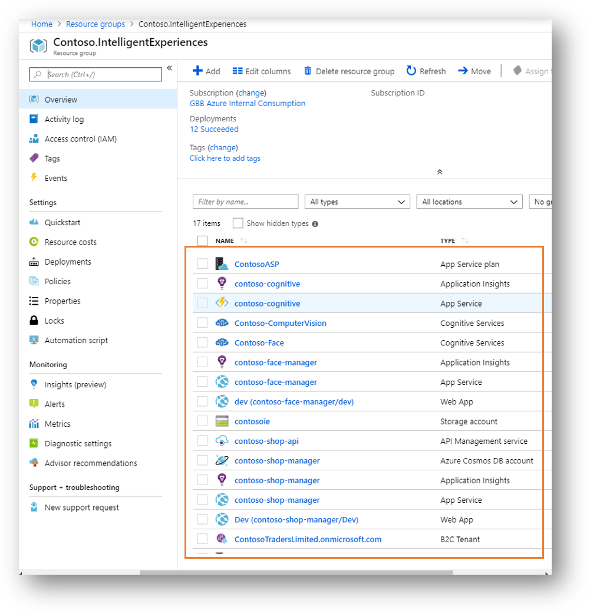

# Contoso Shop Manager Backend

As per the [architecture options discussed](../02-ArchitectureOptions), Contoso Shop Manager system consist of several components as shown in the below reference:

In this walkthrough we will start provisioning all services that were not provisioned as part of the AI services that are provisioned in the previous steps.

>***NOTE:*** On the next guide [Backend-Services-DevOps]() will explore how to continuously build (CI) and deploy (CD) the code leveraging Azure DevOps.

To have a quick overview, we will be provisioning the following services:

***Cognitive Services***

1. Computer Vision Service for OCR
2. Computer Vision Service for Face
3. Custom Vision Service

***Storage Services***

1. Azure Storage
2. CosmosDB

***App Services***

1. App Service
2. Function App
3. API Management

***Operations & Security***

1. Azure DevOps
2. App Center
3. App Insights
4. Azure Key Vault (Optional)
5. Azure ADB2C (Optional)

When everything is provisioned, you should end up with a resource group similar to this:

## Cognitive Services

Please refer back to the previous guided steps to provision and setup the needed AI services.

1. [Cognitive Services - OCR](../03-CognitiveServices-OCR)
2. [Cognitive Services - Face](../04-CognitiveServices-Face)
3. [Cognitive Services - Customer Vision](../05-CognitiveServices-CustomVision)

## Storage Services

Contoso Shop Manager will be using [Azure Storage](https://docs.microsoft.com/en-us/azure/storage/) to store images and for queue triggers to the cognitive pipeline asynchronous requests. Also storage is used by Azure Functions runtime to persist state and settings.

The system also leverage no-sql data store [ComsoDB](https://docs.microsoft.com/en-us/azure/cosmos-db/introduction) to store all information related to system operations and documents processing.

### Azure Storage

Azure Storage is a Microsoft-managed service providing cloud storage that is highly available, secure, durable, scalable, and redundant. Azure Storage includes Azure Blobs (objects), Azure Data Lake Storage Gen2, Azure Files, Azure Queues, and Azure Tables.

Head to [portal.azure.com](https://portal.azure.com) to start provision a new storage account.

If you didn't already done so, create a ***Resource Group*** to be used to provision all services related to this workshop for easy management.

#### Provisioning - Storage Account

Next you can click on ***Create a resource*** and search for [Storage Account]. Fill in the information needed take into consideration that storage account name must be unique across Azure with all small letters (no special characters allowed).

#### Configuration - Storage

Azure Storage required blobs will be created by the Contoso APIs up on initializing it for the first time as you will see later. All just what we need for now to take note of the ***Storage Connection String*** that will be updated in the settings for Azure Functions and App Service.

>***NOTE:*** for more information about the different storage capabilities and options, you can review [Azure Storage Documentation](https://docs.microsoft.com/en-us/azure/storage/).

#### Azure Storage Explorer

A good way to manage your storage accounts (and more) is using the cross platform [Azure Storage Explorer](https://azure.microsoft.com/en-us/features/storage-explorer/).

Through this tool you can easily manage the contents of your storage account. Upload, download, and manage blobs, files, queues, tables, and Cosmos DB entities. Gain easy access to manage your virtual machine disks. Work with either Azure Resource Manager or classic storage accounts, plus manage and configure cross-origin resource sharing (CORS) rules.

### CosmosDB

[Azure Cosmos DB](https://docs.microsoft.com/en-us/azure/cosmos-db/introduction) is Microsoft's globally distributed, multi-model database. With the click of a button, Azure Cosmos DB enables you to elastically and independently scale throughput and storage across any number of Azure's geographic regions. It offers throughput, latency, availability, and consistency guarantees with comprehensive service level agreements (SLAs), something no other database service can offer.

Although Cosmos DB has multiple data models and popular APIs for accessing and querying data (like SQL API, MongoDB API, Cassandara API, Gremilin API,...), we will be using SQL API, a schema-less JSON database engine with rich SQL querying capabilities.

#### Provisioning - Cosmos DB

Again, with the amazing experience in Azure Portal, you can prevision a new CosmosDB:

#### Configuration - Cosmos DB Collections

Collections in the Cosmos DB will be created automatically by the Contoso APIs app and will be populated by sample documents.

Impartant thing is to make sure that the data seeded in the CosmosDB is what you want from here [MockDataSeeder.cs](../../Src/Backend/Contoso.CognitivePipeline.API/Mocks/MockDataSeeder.cs)

Please take note of ***Connection String*** that will be used later in configuration access to both API and Function services later.

>***NOTE:*** for more information about the different Comoso DB capabilities and options, you can review [Cosmos DB Documentation](https://docs.microsoft.com/en-us/azure/cosmos-db/introduction).

#### Azure Storage Explorer for Cosmos DB

A good way to manage your Cosmos DB (like Storage) is using the cross platform [Azure Storage Explorer](https://azure.microsoft.com/en-us/features/storage-explorer/).

## App Services

Azure cloud offers many AppDev-PaaS offerings that make building cloud native backend an easy task which will free you to focus more on the actual value rather than on the infrastructure.

In this section, we will be provisioning 1 API App for hosting our CognitivePipeline.API and 1 Web App for hosting Face Explorer (Optional).

### API Web App

[Azure Web Apps](https://docs.microsoft.com/en-us/azure/app-service/) enables you to build and host web applications in the programming language of your choice without managing infrastructure. It offers auto-scaling and high availability, supports both Windows and Linux, and enables automated deployments from GitHub, Azure DevOps, or any Git repo.

>***NOTE:** C# and .NET Core was selected to be the language used in developing Contoso Shop Manager backend (C# Functions, ASP .NET Core APIs). Keep in mind that all discussed services below support several other languages as well (like Java and JavaScript for example).

#### Provisioning new Web App

Click ***Create a resource*** to add a new Web App:

>***NOTE:*** Optionally you can also provision a second web app for hosting Face Explorer.

#### Configuration - API Web App

After successful provisioning of the web app, you will see you have access to URL and various settings of your web app.

As we don't maintain any secrets or connection strings in the source code, you need to configure the required App Settings to include the appropriate values:

You can also review and update these settings in the source code at [appsettings.json](../../Src/Backend/Contoso.CognitivePipeline.API/appsettings.json) so you can run the code locally if you wish.

>***NOTE:*** Notice the Azure Function related settings need to be updated after provisioning the Azure Function App later.

It is very good practice to provision at least 1 [Staging Slot](https://docs.microsoft.com/en-us/azure/app-service/deploy-staging-slots). You can use this slot to release your updates first before moving it to production slot.

>***NOTE:*** The app must be running in the Standard, Premium, or Isolated tier in order for you to enable multiple deployment slots.

Start creating the Dev deployment slot after fulling configuring the production app service settings first so you can copy all these settings to the new slot.

### Function App

For simplicity, all Cognitive Pipeline services are deployed to a single function app.

#### Provisioning New Function App

You can go ahead with provisioning a new consumption based function app on Azure Portal:

When you complete your function app provisioning and deploying the function code later in the DevOps guide, you will have something like this:

#### Configuration - Function App

When provisioning completes, open the Application Settings in order to include all needed secrets as we did with API App Service before:

You can also create a copy of [host.json](../../Src/Backend/Contoso.CognitivePipeline.BackgroundServices/host.json) and rename it to [local.settings.json](../../Src/Backend/Contoso.CognitivePipeline.BackgroundServices/local.settings.json). Then replace all relative values with the ones that reflect your provisioned environment.

This will allow you also to run the functions locally on your machine using Azure Functions CLI in Visual Studio Code or Visual Studio.

>***NOTE:*** Some of the settings will be created by the Function runtime, you don't need to change anything there.

Deployment of Contoso Cognitive Pipeline functions will be done via DevOps CI/CD pipelines that we will be discussing in the next guide.

### API Management

All APIs are exposed via [API Management Service](https://azure.microsoft.com/en-us/services/api-management/) which act as our turnkey API gateway solution.

All APIs will be accessed through enforced policy and subscription access.

>***NOTE:*** All APIs should not exposed directly to consumers. You should always plan to place and API Gateway in the middle.

#### Provisioning New API Management Service

API Management service is very easy to setup, just click Create new service and select or search for API Management:

>***NOTE:*** API Management provisioning takes a little bit more time compared to other services.

#### Configuration - API Management

We will tackle this later after we deploy the actual API source code to our App Service.

This is what you would have after fully importing the cognitive APIs swagger definitions:

## Operations (DevOps)

Now it is time to setup the initial environments for DevOps.

### Azure DevOps

If you don't have already an account with Azure DevOps, you can go ahead and provision a new one here [Azure DevOps](https://azure.microsoft.com/en-us/services/devops/?nav=min).

Azure DevOps offers unlimited free private repos, 5 basic free licenses and free build minutes. So go ahead and get started.

As Microsoft is committed to Open Source, [Azure Pipelines](https://docs.microsoft.com/en-us/azure/devops/pipelines/repos/github?view=vsts) are free for public projects offering 10 pipeline with unlimited hours :).

>***NOTE:*** This workshop is leveraging Azure Pipelines for GitHub to have integrated build and release services for our projects.
>

#### Create New Project

After successfully signing in to Azure DevOps, you can start by creating your first project:

#### Get Source Code Repository Setup

Now it is up to you, either import the workshop repo to [Azure Repos](https://azure.microsoft.com/en-us/services/devops/repos/) or fork it to your GitHub account to start using your own Azure Pipelines.

##### Using Azure Repos

##### Using GitHub

#### Configuring Pipelines

Azure Pipelines as I said before, works with both GitHub and Azure Repos (and several others source control). Now that you have your own copy setup, it is time to activate the automated build pipelines.