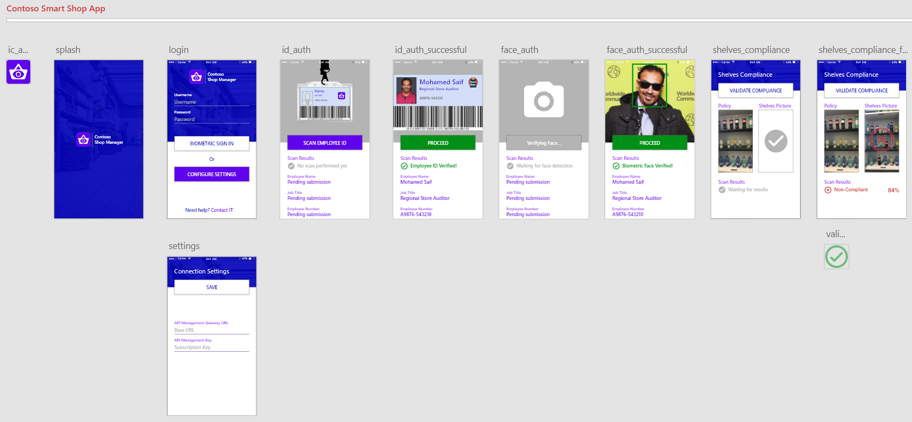

# Contoso Shop Manager

Contoso Shop Manager App is a cross platform mobile application that would allow store auditor to scan the shelves compliance after successful biometric authentication

>***NOTE*** You must deploy the backend first before being able to use the mobile apps. Please refer back to this workshop guide to achieve that.

## Technical Implementation

Making a decision to use Xamarin Forms to build a cross platform native mobile apps was logical choice given that all requirements (including some of each platform native features) would be achieved.

## Current Implementation

Application was designed using Adobe XD to create native exportable design assets. The [ContosoSmartShop.xd](../../ContosoSmartShop.xd) design design file is already part of this workshop files.

## Source Code

I've decided to add the source code to another repo. You can find all source code [here](https://github.com/mohamedsaif/ContosoShopManager.App)